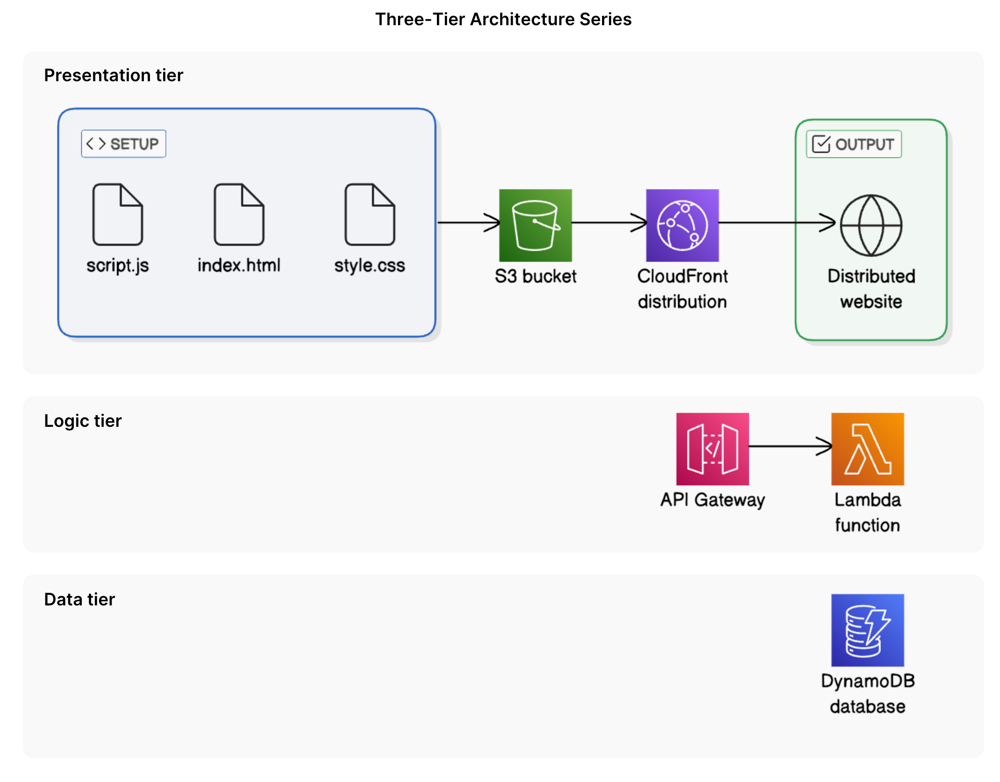
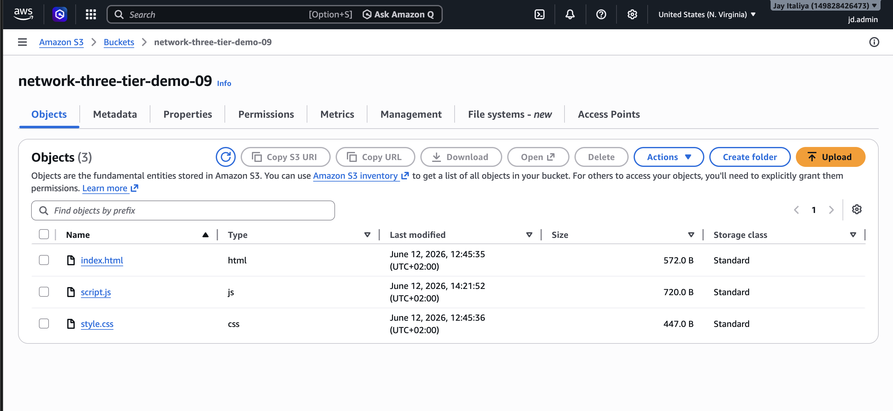
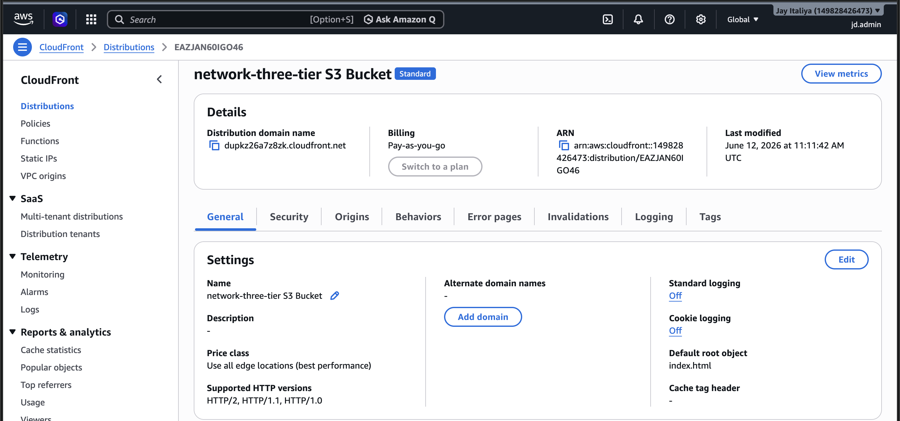
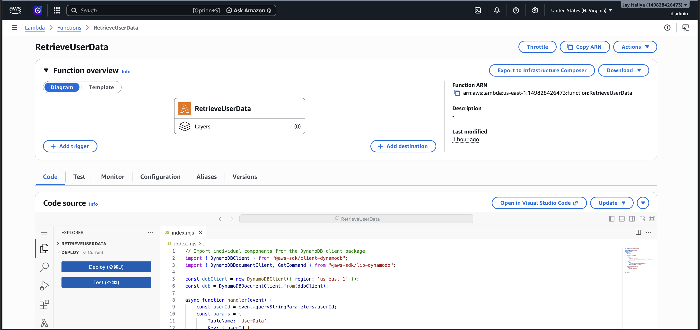
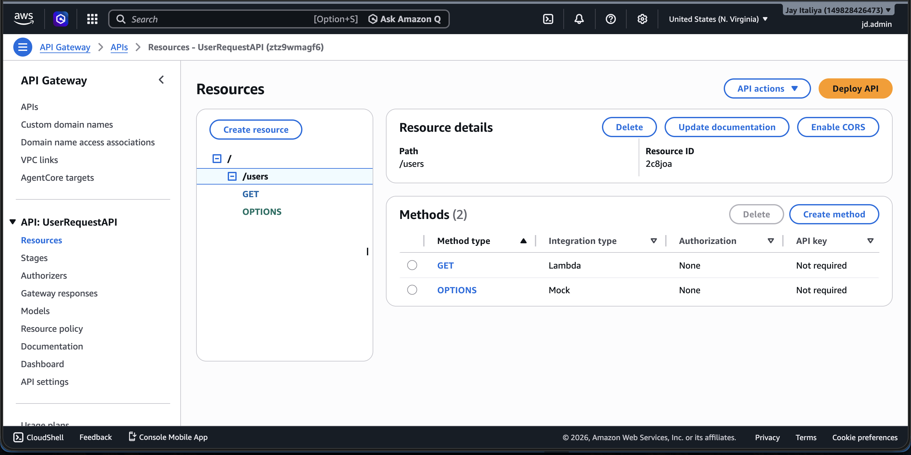
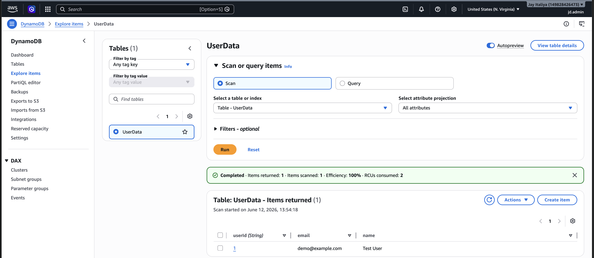
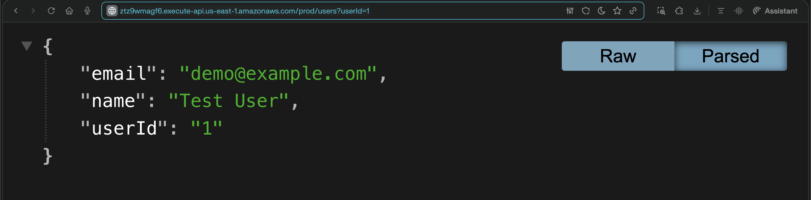
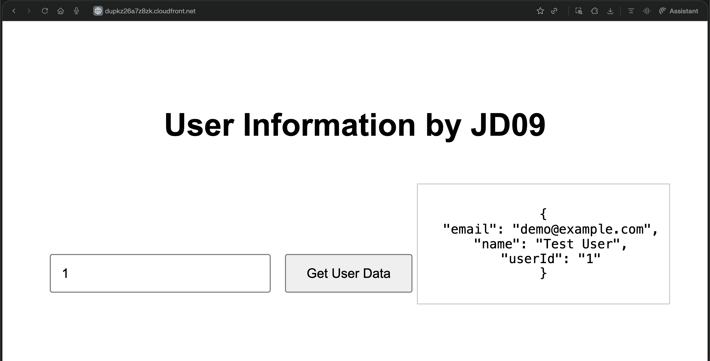

# AWS Three-Tier Web Application

A simple **serverless three-tier web application** built on AWS using S3, CloudFront, API Gateway, Lambda, and DynamoDB. This project demonstrates how a frontend, backend logic, and database layer can work together in a scalable cloud architecture. 

## Project Overview

This project follows a three-tier architecture:

- **Presentation tier**: Static frontend hosted with Amazon S3 and delivered through Amazon CloudFront.
- **Logic tier**: REST API built with Amazon API Gateway and AWS Lambda.
- **Data tier**: User data stored and retrieved from Amazon DynamoDB.

The application allows a user to enter a `userId`, send a request to the backend API, and fetch user details stored in DynamoDB.

## Architecture

```text
User
  ↓
CloudFront
  ↓
S3 (Frontend: HTML, CSS, JS)
  ↓
API Gateway
  ↓
Lambda
  ↓
DynamoDB
```

## AWS Services Used

| Service | Purpose |
|---------|---------|
| Amazon S3 | Stores the frontend static website files |
| Amazon CloudFront | Delivers the frontend globally with low latency |
| Amazon API Gateway | Exposes the backend API endpoint |
| AWS Lambda | Processes requests and fetches data |
| Amazon DynamoDB | Stores user records |

## Repository Structure

```bash
.
├── frontend
│   ├── index.html
│   ├── style.css
│   └── script.js
├── backend
│   └── lambda_function.js
└── README.md
```

## Application Flow

1. The user opens the web application through a CloudFront URL.
2. CloudFront serves the static frontend files from S3.
3. The user enters a `userId` and clicks the button to fetch data.
4. The frontend JavaScript sends a request to API Gateway.
5. API Gateway triggers the Lambda function.
6. Lambda reads the matching record from DynamoDB.
7. The response is returned to the frontend and displayed in the browser.

## Key Features

- Serverless architecture
- Static frontend hosting
- Global content delivery with CloudFront
- REST API integration with API Gateway
- Backend logic with Lambda
- NoSQL data storage using DynamoDB
- End-to-end integration between all three tiers

## Screenshots

### 1. Architecture Diagram



### 2. S3 Bucket Setup
Add a screenshot of the S3 bucket containing the uploaded frontend files (`index.html`, `style.css`, `script.js`).



### 3. CloudFront Distribution



### 4. Lambda Function



### 5. API Gateway Resources
Add a screenshot showing the `/users` resource and the `GET` method in API Gateway.



### 6. DynamoDB Table



### 7. API Test in Browser



### 8. Final Working Web App




## Challenges and Fixes

### Issue: Frontend could not fetch data
Initially, the frontend could not retrieve data from the backend because the API URL placeholder in `script.js` had to be replaced with the deployed API Gateway invoke URL.

### Issue: CORS error
A CORS error occurred because API Gateway and Lambda were not configured to allow requests from the frontend domain. This was resolved by enabling CORS in API Gateway and returning `Access-Control-Allow-Origin` headers from Lambda.

## What I Learned

Through this project, I learned how to:

- Host a static frontend using S3
- Use CloudFront as a CDN for faster delivery
- Build and deploy a serverless backend with Lambda
- Create REST endpoints with API Gateway
- Store and retrieve structured data from DynamoDB
- Connect frontend, backend, and database into a complete three-tier application
- Debug integration issues such as incorrect API endpoints and CORS errors

## Future Improvements

- Restrict CORS to the CloudFront domain only
- Add better frontend validation and error messages
- Use Infrastructure as Code with Terraform or AWS CloudFormation
- Add authentication using Amazon Cognito
- Deploy with CI/CD using GitHub Actions

## How to Run Locally

1. Clone the repository:
   ```bash
   git clone https://github.com/JayItaliya09/AWS-simple-three-tier-web-app.git
   ```

2. Open the `frontend` folder.

3. Update the API URL inside `script.js` with your deployed API Gateway endpoint.

4. Open `index.html` in a browser.

## Author

**Jay Italiya**

- GitHub: [JayItaliya09](https://github.com/JayItaliya09)